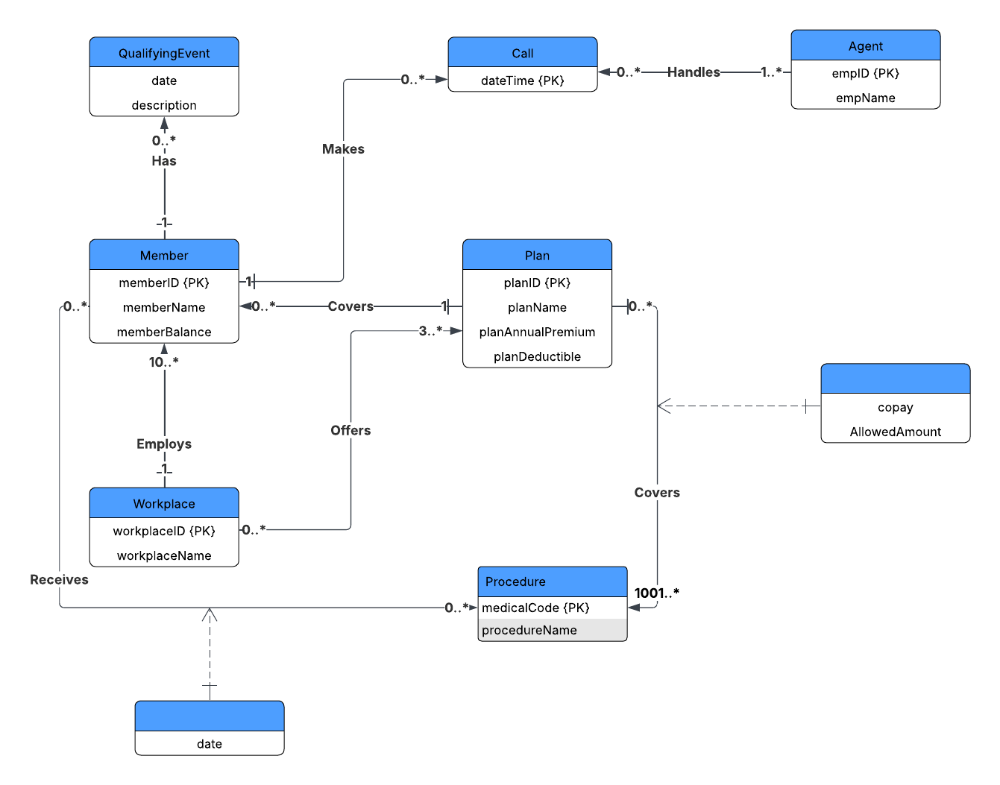

# Database Normalization

## Overview
Welcome to my database normalization project! The database is for designed for a health insurance management system and applies the principles of normalization, specifically achieving Third Normal Form (3NF). It includes various tables such as workplaces, members, procedures, agents, plans, and more. Additionally, the database incorporates foreign keys (FK) and primary keys (PK) to establish relationships between different entities.

## Tech Stack
- MySQL: The primary technology used for developing the database schema, stored procedures, and quieries.
- MySQL Workbench: Used for visual modeling of the database structure and executing queries.
- Tableau: Used for data visualization and analysis.

## Database Structure

The database is designed to be in Third Normal Form, adhering to the following principles:

- Each table represents a single entity.
- Data redundancy is minimized by eliminating repeating groups and storing data in separate tables.
- Relationships between entities are formed using foreign keys, ensuring referential integrity.

#### ER Diagram

## Installation

1. Clone this repo to your local machine.
2. Run the master script file to construct the database with dummy data.
